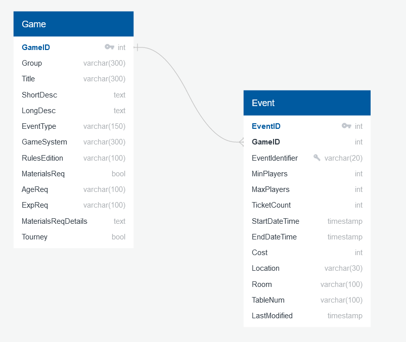

# EventDistiller
Gencon Event Collaboration Tool

The purpose is to provide a way for a group to rank and prioritize a list of events. 

Currently, this is a mono-repo with all the components to host a local instance of the application.  It may evolve past this point, but it may not.  The intention is to only use open source software and to make this as open source as possible. 

# Road Map

1. DB Schema and Table creation
2. Load Gencon data from 2023 as a set for testing (EventParser)
3. Post Processing the Data:
    a. Add links and data from BoardGameGeek for board games and card games
    b. Correlate data... maybe needs to be in the parsing step?
4. Display events in meaningful ways
    a. List of Games with Events(aggregated)
    b. List of Events within a Game page
    c. Way to update or connect two different events as related 
    d. Ways to filter lists down
5. Create user data tables
6. Create ranking methodology for games/events in the same year/conference
7. Create aggregated results of ranking 
8. Automated schedule creation based on ranking within given time parameters


## Running the stack

Simply ensure you have everything properly configured in the `docker-compose.yml` then run the following:

```docker-compose up```

# Designs

## DB Tables
In QuickDBD, a rough outline of [the table structure was created](https://app.quickdatabasediagrams.com/#/d/9eHotm).



# Dev Env

## Windows

Currently the development is being done on a windows machine and as such is designed to be done that way.  It is possible to do development else where but there may be tweaks that are needed to make it work correctly.

### Docker Compose
Utilizing docker and docker compose files will allow for ease of deployment locally.  

Note: Docker on Linux Subsystem in Windows, be careful with relative paths.  `./` file notation points to a volume pointer deep in the subsystem (`\\wsl.localhost\docker-desktop-data\mnt\wslg\distro\data\docker\volumes\`) and not the local file location. Use `${pwd}` when needing to reference the current folder.  See: https://stackoverflow.com/a/65973791  Lesson cost: hours, surprising given previous lesson on relative pathing was just a day before with Postgres, PGAdmin4, and PassFiles. 

### Postgres
Honestly, the choice here is familiarity.  It will allow a fairly easy migration to a cloud system if desired as it could go straight to Amazon RDS or similar products.  In order to easily use it, setting up PGAdmin4 seemed like the most responsible choice.

The development setup is utilizing a simple mainly passwordless system to ease dev, at the cost of understanding how the `server.json` pathing works for PGAdmin4.  Long story short, see: https://stackoverflow.com/q/66578506

### Sqitch

Sqitch was chosen as the database migration utility as it is completely language agnostic. As it stands there maybe different parts of this system that are built in very different languages. Having this agnostic allows for flexibility moving forward. 

Following Tutorial: https://sqitch.org/docs/manual/sqitchtutorial/

#### Sqitch on Docker & Windows

The intention is to have all the configuration for Sqitch under `sqitch_config`.  This will allow for ease of deployment while developing the application but also allow for deployment later if decided to pursuit it. 

With this came one difficulty around documentation and utilization from a docker perspective.  The guideline wants individuals to utilize [the bash](https://github.com/sqitchers/docker-sqitch/blob/main/docker-sqitch.sh) or [batch scripts](https://github.com/sqitchers/docker-sqitch/blob/main/docker-sqitch.bat) to connect [the container](https://hub.docker.com/r/sqitch/sqitch/) to the host machine.  What this fails to handle is that user's personal accounts don't always tie to their online presence.  In order to avoid this, development will utilize a series of commands to setup and connect to a Sqitch docker container.

Sqitch utilizes a single command input per run of a docker container, this would lead to a rather frustrating development experience.  To avoid this, research was done to understand the necessary inputs to the container, the follow is a simplified base input for `./sqitch init` utilizing the docker container. 

```
docker run --rm --network host -v ${pwd}/sqitch_config:/repo --env SQITCH_ORIG_SYSUSER=terinHD --env SQITCH_ORIG_EMAIL=terinHD@gmail.com sqitch/sqitch init EventDistiller --uri https://github.com/TerinHD/EventDistiller --engine pg
```

Once that is understood, it is simple to put [an alias into powershell](https://learn.microsoft.com/en-us/powershell/module/microsoft.powershell.utility/set-alias) to allow for sqitch like commands from the tutorial:

```
PS > Function Sqitch_Docker_Command {docker run --rm --network host -v ${pwd}/sqitch_config:/repo --env SQITCH_ORIG_SYSUSER=terinHD --env SQITCH_ORIG_EMAIL=terinHD@gmail.com sqitch/sqitch}

PS > Set-Alias -Name sqitch -Value Sqitch_Docker_Command -PassThru | Format-List -Property *

HelpUri             :
ResolvedCommandName : Sqitch_Docker_Command
DisplayName         : sqitch -> Sqitch_Docker_Command
ResolvedCommand     : Sqitch_Docker_Command
Definition          : Sqitch_Docker_Command
Options             : None
Description         :
OutputType          : {}
Name                : sqitch
CommandType         : Alias
Source              :
Version             :
Visibility          : Public
ModuleName          :
Module              :
RemotingCapability  : PowerShell
Parameters          : {}
ParameterSets       :

PS > sqitch help
Usage
      sqitch [--etc-path | --help | --man | --version]
      sqitch <command> [--chdir <path>] [--no-pager] [--quiet] [--verbose]
             [<command-options>] [<args>]
...
```

To Remove the Alias:
```
PS > Remove-Item -Path Function:\Sqitch_Docker_Command

### Powershell 5 
PS > Remove-Item Alias:sqitch
### Powershell 6+
PS > Remove-Alias -Name sqitch
```

Currently this still isn't working like I would like it to... need to figure it out... 

Kif Sigh Gif goes here.